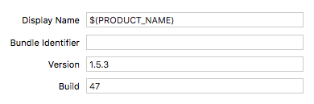

## Guidelines
---

> [Home page](/README.md)

## Project Folder Structure

Separate project by modules, for example `Login`, `Settings`, etc. For each module create a folder in a file system and add it to the xcode project, that way when you add files in this category using xcode the files by default will go in correct folder in a file system. Place all xib and storyboards files and classes related to a module together.

You can place common files/classes that are used by many modules in separate folder/category. It's often the case for models.

```
.
├── Application
│   └── (xcodeproj, xcworkspace and other project files)
│   └── {Project name}
│       └── (Module)
│           └── (MVC/MVVM/VIPER files with xibs and storyboards)
│       └── Commons
│       └── Resources
│           └── (Fonts, Info, Configurations)
├── Artifacts
│   ├── (certificates and other files)
│   └── Provisioning
│       └── (Provisioning profiles)
└── README.md
```

## Xcode Project Environment Configuration

Don't use targets to configure environment of an application, use configurations and schemes instead. By default any project already contains `Debug` and `Release` configurations. Create additional configurations, for example: `Debug.Prod`, `Release.Prod`, `AppStore.Prod`. Add additional schemes: `Prod`, `AppStore` and setup correct configurations for `Build`, `Run`, `Test`, `Profile`, `Analyze`, `Archive`. Then you can add user-defined settings (Build Settings > Add User-Defined Setting) and use them in info.plist file, for example: `APP_ENV = dev` is user-defined setting you can use it in info.plist as `$(APP_ENV)`.

1. Add user-defined setting in 'Build Settings'
2. Use it as SETTING: `$(SETTING)` in Info.plist
3. Access it later in code: `let appEnv = Bundle.main.object(forInfoDictionaryKey: "APP_ENV") as? String`

Best example -  API base url.

## Build number

Version of an app should have the following format: `{major}.{minor}.{patch}`, build number is just an integer.
For different releases in crashlytics you can add any word into `{patch}`



## Optimizing build times

Use [this repo](https://github.com/fastred/Optimizing-Swift-Build-Times) for last information about optimization

## Autolayout

Nowadays it's very hard to code without Autolayout, so use it. Be aware of `safeAreaLayoutGuide` when you layout your views from top to bottom.
For custom views you can override `intrinsicContentSize` with `UIViewNoIntrinsicMetric` for one or both dimensions.

Prefer to not place all views in one big view or view controller, separate them by functionality and move them in their own xib for future reusability.

## Geolocation

 - [Presentation for reference](https://my.visme.co/projects/pv07yg0e-background-location-tracking-ios)
 - Don't use geolocation permanently. We should stop updating geolocation after recieving a location.
 - See example in the file [`Location Tracking.zip`](Talks/Presentations/Location%20Tracking.zip)

## Push Notifications

Great guide on implementing push notifications is [this article](https://medium.com/flawless-app-stories/ios-remote-push-notifications-in-a-nutshell-d05f5ccac252)

Generate pem from p12:
```
openssl pkcs12 -in apns-dev-cert.p12 -out apns-dev-cert.pem -nodes -clcerts
```

> [Home page](/README.md)
